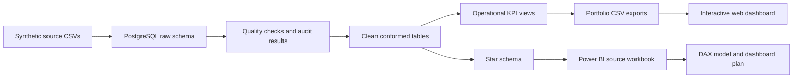

# Supply Chain & Operations Control Tower

An end-to-end BI and operations analytics portfolio project for a fictional German fulfilment network. It turns intentionally imperfect source files into tested PostgreSQL data, management KPIs, root-cause analysis, a dimensional model, and a Power BI-ready reporting package.

All companies, people, orders, and results are synthetic. The project demonstrates analytical method and technical capability; it does not claim real business impact.

## Portfolio outcome

- 30,000 unique orders across 12 months, with connected shipment, inventory, product, warehouse, carrier, and customer data
- reproducible Python data generation with a fixed seed and a machine-readable quality manifest
- PostgreSQL pipeline from immutable raw data through cleaned tables, analytical views, and a star schema
- 18 source-data checks and 10 dimensional-model checks, all enforced by SQL
- decision-focused KPI and root-cause queries for delivery, backlog, warehouse capacity, inventory, carriers, and customer segments
- an interactive web dashboard with executive, fulfilment, inventory, and diagnostic views
- a browser-ready Excel source, two DAX measure libraries, relationship maps, a theme, and a four-page Power BI dashboard specification
- beginner-friendly learning notes, an interview guide, CV bullets, and full reproduction instructions

## Business problem

Management receives separate operational files and cannot reliably answer:

- Are orders being delivered on time and within SLA?
- Which warehouses, carriers, or exception types cause delays?
- Where is backlog accumulating, and what value is at risk?
- Are stockouts associated with slower fulfilment?
- How do demand, revenue, throughput, and inventory health change over time?

The control tower creates one governed analytical layer for these questions.

## Architecture



The raw layer preserves source-like records. The clean layer standardises and flags them without hiding rejected rows. The analytics layer contains reusable KPI views and a dimensional model designed for BI reporting.

## Dataset scope

| Area | Scope |
|---|---:|
| Reporting period | 1 Sep 2025–31 Aug 2026 |
| Analysis date | 1 Sep 2026 |
| Unique orders | 30,000 |
| Shipments | 28,534 |
| Daily inventory snapshots | 262,800 |
| Products | 120 |
| Warehouses | 6 |
| Carriers | 7 |
| Customers | 4,000 |

The raw files also include controlled duplicates, invalid relationships, inconsistent labels, impossible dates, missing values, and inventory anomalies. These cases are deliberate and documented in the [data-quality manifest](data/quality_manifest.json).

## Validated headline KPIs

| KPI | Result |
|---|---:|
| Analysis-eligible orders | 29,873 |
| Analysis-eligible shipments | 28,366 |
| Revenue | €3,221,285.15 |
| Average order value | €110.71 |
| On-time delivery | 62.32% |
| Late delivery | 37.68% |
| Average delay | 0.76 days |
| Average fulfilment lead time | 1.43 days |
| Open backlog | 688 orders |
| SLA breach rate | 38.78% |
| Throughput | 67,281 units |
| Stockout rate | 0.35% |
| Inventory turnover | 4.30 |
| Shipment exception rate | 28.14% |

Definitions and denominators are documented in the [KPI catalogue](documentation/05_kpi_catalog.md), so the metrics are reproducible rather than presentation-only figures.

## Main findings

- The Rhine-Ruhr Fulfilment Centre in Cologne is the main operational constraint: 55.62% on-time delivery, a 36.81% exception rate, and 117 days above capacity.
- Warehouse-capacity exceptions affect 4,709 shipments, represent 59% of recorded exceptions, and are linked to 3,822 late deliveries.
- Economy carriers are materially weaker in this simulation: Alpine Freight delivers 27.98% on time and EuroLink Standard 30.81%, compared with about 86% for the two express carriers.
- Orders associated with a stockout are late 96.70% of the time, versus 36.98% without a linked stockout. This is an association, not proof of causation.
- Open backlog contains 688 orders; 464 are at least 15 days old, with €52,374.40 in order value.
- December demand reaches 3,884 orders, then falls to 2,075 in January, exposing a seasonal capacity-planning risk.

The supporting SQL evidence and appropriately scoped recommendations are in [findings and recommendations](documentation/07_findings_and_recommendations.md).

## Dimensional model

The full PostgreSQL model retains transaction-level detail:

| Fact table | Grain | Rows |
|---|---|---:|
| `analytics.fact_orders` | one row per unique order | 30,000 |
| `analytics.fact_shipments` | one row per unique shipment | 28,534 |
| `analytics.fact_inventory` | one product–warehouse–date snapshot | 262,800 |

Shared dimensions are Date, Product, Customer, Warehouse, and Carrier. Unknown-member rows protect model integrity when source keys are missing or invalid. The design and relationship rules are explained in [dimensional model](documentation/06_dimensional_model.md).

## Interactive dashboard

Open the public [Supply Chain Operations Control Tower dashboard](https://akshayamin13.github.io/supply-chain-control-tower-dashboard/) to explore the validated portfolio results through four interactive views. It includes warehouse, carrier, and product-category filters; executive KPIs; monthly trends; fulfilment and inventory analysis; and high-risk order diagnostics.

The dashboard requires no sign-in, and its [source repository](https://github.com/Akshayamin13/supply-chain-control-tower-dashboard) is public. Like the underlying project, all dashboard data is synthetic.

## Power BI package for an Intel Mac

Power BI Desktop is a Windows application, so this repository includes a browser-first handoff that can be used in the Power BI service:

- `control_tower_powerbi_browser_source.xlsx` with eight named Excel tables
- `measures_browser_aggregate.dax` for the compact browser model
- `measures.dax` for the full transaction-level model
- relationship maps for both models
- a four-page dashboard specification and JSON theme
- KPI reconciliation proving that all 16 browser-model headline measures equal the full PostgreSQL model

The report pages themselves are intentionally not claimed as complete: they must be assembled in a signed-in Power BI workspace. Start with the [Mac workflow](powerbi/mac_workflow.md) and [dashboard specification](powerbi/dashboard_specification.md).

## Reproduce the project

Prerequisites: Python 3.9+, PostgreSQL 16 or a compatible recent version, and Git. The data generator uses only the Python standard library.

```bash
python3 scripts/generate_data.py
python3 scripts/validate_generated_data.py
bash scripts/run_pipeline.sh
```

The pipeline creates the local `supply_chain_control_tower` database when needed and runs all numbered SQL scripts in order. It stops at the first failed test. Detailed setup, verification queries, and workbook instructions are in the [reproduction guide](documentation/09_reproduction_guide.md).

## Repository guide

```text
data/raw/          reproducible source-like CSV files
data/processed/    management-ready SQL result exports
documentation/     business, technical, learning, and interview documentation
outputs/           Power BI browser-source workbook
powerbi/           DAX, theme, relationship maps, and dashboard specification
scripts/           data generation, validation, pipeline, and workbook utilities
sql/               numbered PostgreSQL pipeline and learning queries
```

Useful entry points:

- [database basics](documentation/01_database_basics.md)
- [source design](documentation/02_source_data_design.md) and [data dictionary](documentation/03_data_dictionary.md)
- [SQL pipeline walkthrough](documentation/04_sql_pipeline.md)
- [SQL learning reference](documentation/11_sql_learning_reference.md)
- [interview guide](documentation/08_interview_guide.md)
- [CV and portfolio wording](documentation/10_cv_and_portfolio.md)

## Skills demonstrated

PostgreSQL, SQL data cleaning, data-quality controls, KPI governance, dimensional modelling, root-cause analysis, supply-chain analytics, DAX design, Power BI semantic modelling, Python data generation, Git, documentation, and evidence-based business communication.

This scope is aligned with Operations Analyst, Supply Chain Analyst, Logistics Analyst, BI Analyst, Reporting Analyst, Inventory Analyst, and Operations Performance Analyst applications in Germany.
