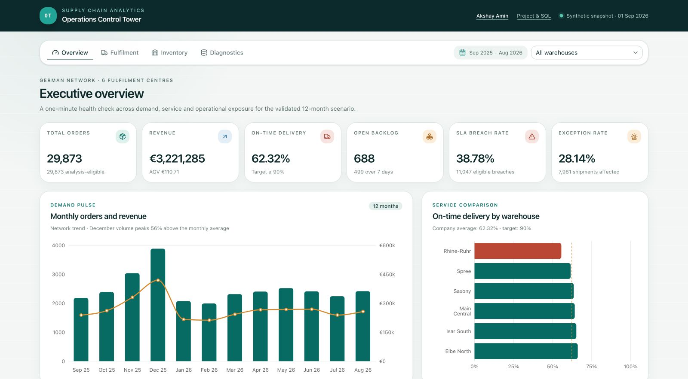
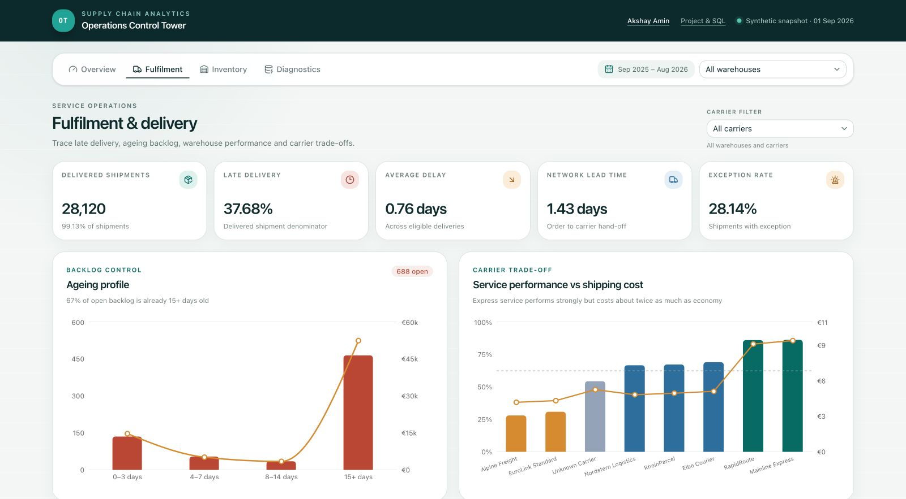
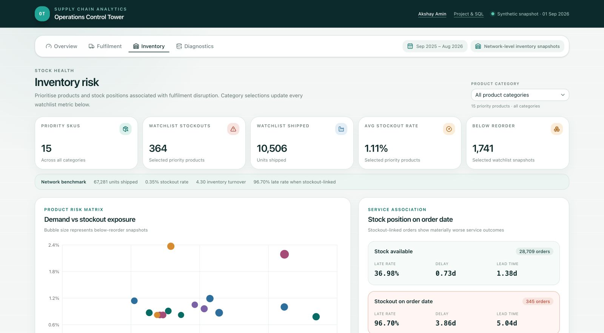
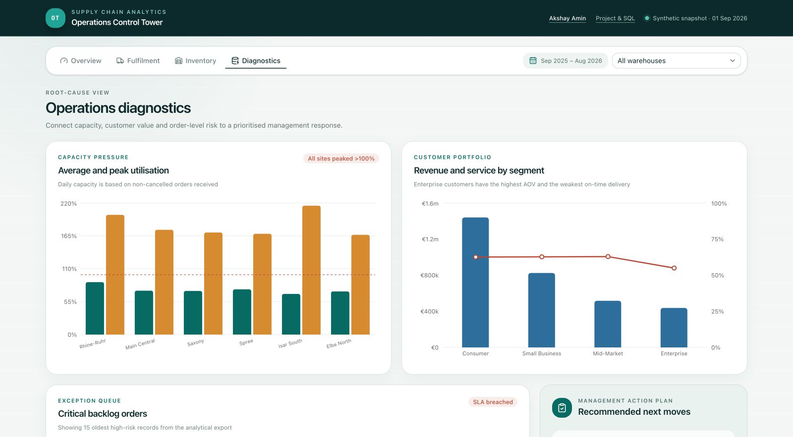
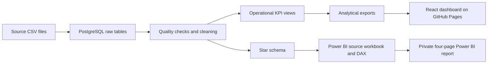
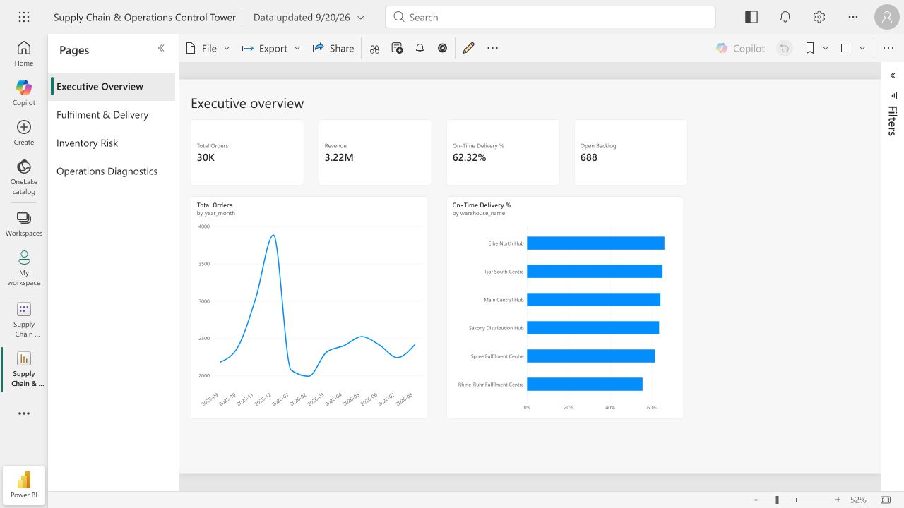
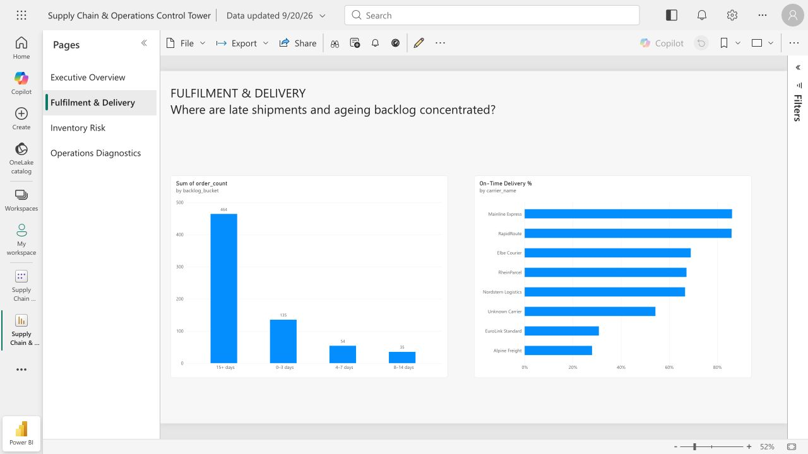
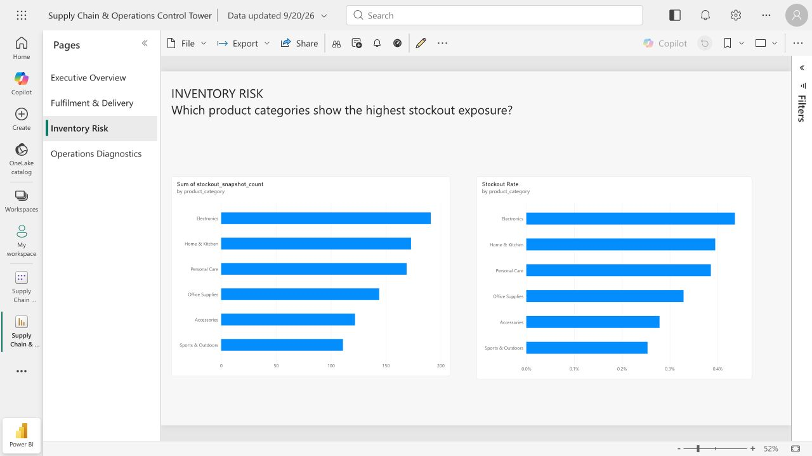
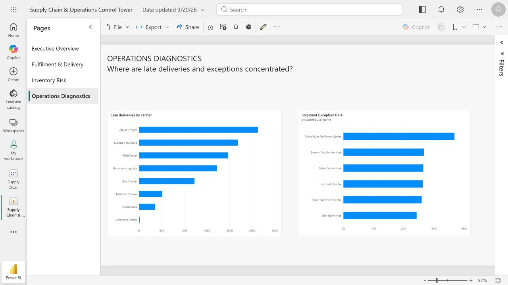

# Supply Chain & Operations Control Tower

Where should an operations team intervene when deliveries are late across a six-site German fulfilment network?
In this 30,000-order synthetic case, Cologne is the first place to investigate: **55.62% on-time delivery and 117 days above capacity**.
Across the network, warehouse-capacity exceptions are recorded against **4,709 shipments**, including **3,822 late deliveries**.
My recommendation is to test capacity-aware routing and shift coverage in Cologne, resolve the oldest backlog, and review replenishment for the most exposed products.
These are proposed actions supported by the analysis; no service improvement or cost saving has been measured.

**Akshay Amin** · [GitHub profile](https://github.com/Akshayamin13) · **[Open the live dashboard](https://akshayamin13.github.io/supply-chain-operations-control-tower/)**

All records, company names and business results are synthetic. The project covers September 2025–August 2026, with a fixed analysis date of 1 September 2026. It uses no employer or customer data.



## Kurzfassung

Dieses Portfolio-Projekt untersucht Lieferleistung, Bestände und operative Risiken in einem fiktiven deutschen Logistiknetzwerk.
Die Grundlage bilden 30.000 synthetische Aufträge aus zwölf Monaten und sechs Logistikstandorten.
Der Standort Köln erreicht eine Termintreue von 55,62 % und überschreitet an 117 Tagen seine Tageskapazität.
Kapazitätsengpässe sind netzwerkweit bei 4.709 Sendungen erfasst, darunter 3.822 verspätete Lieferungen.
Ich empfehle, die Kapazitätsplanung zu überprüfen, alte Auftragsrückstände zu klären und kritische Artikel gezielt nachzubestellen.
Die Analyse wurde mit PostgreSQL und Python umgesetzt; das öffentliche Web-Dashboard zeigt die Ergebnisse. Im privaten Power-BI-Arbeitsbereich gibt es außerdem einen vierseitigen Bericht mit 15 gespeicherten DAX-Kennzahlen. Die öffentliche Freigabe und die vollständige Gestaltung nach Berichtsspezifikation stehen noch aus.

## What I would recommend

| Priority | Evidence in the scenario | Proposed action and how to assess it |
|---|---|---|
| **Investigate Cologne capacity first** | 55.62% OTD; 117 days above capacity; 36.81% shipment exception rate | Introduce a proposed 90% forecast-capacity warning. Test revised shift coverage and a small rerouting pilot only after checking receiving-site capacity, stock and transit time. Compare OTD, exception rate and cost before expanding. |
| **Resolve the oldest backlog** | 464 orders are at least 15 days old, representing €52,374.40 | Put these orders in an owner-assigned review queue. Confirm whether the recorded status is current, then resolve or escalate each case. Track the remaining count and value daily. |
| **Review replenishment for exposed products** | Kitchen Scale 09 has 52 stockout snapshots; Electric Toothbrush 01 has 48 | Review demand, supplier lead time and reorder settings for these warehouse–product combinations. Track stockout frequency alongside delivery performance before applying a wider policy change. |

The capacity exception count is an observed association, not a count of deliveries that rerouting would recover. The dataset does not establish a safe transfer percentage or a causal improvement estimate.

[Detailed findings and query evidence](documentation/findings.md) · [KPI definitions and denominators](documentation/kpis.md)

## Dashboard views

The screenshots below are captures of the working **React web dashboard**, not Power BI report pages. Use the [live dashboard](https://akshayamin13.github.io/supply-chain-operations-control-tower/) to try the filters.

### Fulfilment & delivery

Compare warehouse delivery performance, inspect backlog ageing and select a carrier to see its delivery reliability, delay, shipping cost and exception rate.



### Inventory risk

Select a product category to update the priority-SKU cards, demand-versus-stockout chart and product watchlist. Network benchmarks remain visible for comparison.



### Operations diagnostics

Filter warehouse capacity and the critical-order queue, then compare customer segments and review the proposed management actions.



**Filter scope:** warehouse selection affects warehouse-specific views; a selected carrier shows network-wide carrier results. Inventory uses network-level category summaries. Monthly company trends, backlog ageing and selected comparison panels remain network benchmarks. These aggregate exports do not support arbitrary warehouse × carrier combinations.

## Why I built it this way

In my Amazon operations support role, I tracked delayed shipments, ageing backlog and stuck inventory, then prepared escalation lists for the teams responsible for the next action. That experience shaped the order of this dashboard: start with the service result, locate the warehouse or carrier issue, then reach the orders that need an owner. The backlog buckets and high-risk order queue are there to support that daily triage, not just to fill a report page.

At Rockid.One, I brought finance sheets, CRM exports and other reporting inputs into structured KPI tables for weekly management reviews. That is why this project keeps its metric definitions and SQL quality checks alongside the visuals. A clean chart is only useful if another analyst can trace the number back to an eligible record and understand what was excluded.

The project runs on a 2019 Intel MacBook Air. I built the PostgreSQL model and checked the measures before designing the report, so the results can be inspected without relying on the dashboard. I kept orders, shipments and inventory in separate fact tables because their grains differ; joining everything into one table would repeat order value across inventory snapshots.

The synthetic dataset makes the work shareable and repeatable without using confidential operational records. It also limits the conclusions: the patterns reflect the generator's assumptions, and the very old backlog needs status validation before it could be treated as a real operational workload.

### Decisions I changed

- **Reporting cutoff:** an early generator version could create shipment events after the analysis date. I changed it so those orders remain Processing or On Hold until they can ship. The fix and regenerated source files are recorded in [commit d3eeae5](https://github.com/Akshayamin13/supply-chain-operations-control-tower/commit/d3eeae54ffcbeff0cf21b0d01dfe1ceee737baaf).
- **Dashboard packaging:** consolidating the dashboard into this repository removed a stylesheet dependency used by the tab controls. The result was a blank side panel on GitHub Pages. I restored the required component-state styles and checked all four tabs and the carrier filters in the published build: [commit b2a03e3](https://github.com/Akshayamin13/supply-chain-operations-control-tower/commit/b2a03e321e4380d01344e102f91b01191e979d10).

[Design choices and trade-offs](documentation/design-decisions.md)

## Data and quality controls

| Source | Unique records |
|---|---:|
| Orders | 30,000 |
| Shipments | 28,534 |
| Daily inventory snapshots | 262,800 |
| Products | 120 |
| Warehouses | 6 |
| Carriers | 7 |
| Customers | 4,000 |

The fixed-seed generator adds duplicates, missing keys, broken relationships, inconsistent labels, invalid quantities, impossible dates and inventory-balance errors. The [quality manifest](data/quality_manifest.json) records the expected cases; an independent Python validator and 18 SQL source checks verify them.

Raw values remain available for audit. Cleaning removes duplicate copies, standardises known labels and flags invalid records. The star schema retains Unknown dimension members, and ten model checks reconcile its grain, relationships and values. KPI-specific rules produce **29,873 eligible orders** and **28,366 eligible shipments**.

[Source design](documentation/source-data.md) · [Data dictionary](documentation/data-dictionary.md) · [Cleaning rules](documentation/pipeline.md)

## Key results

| KPI | Result |
|---|---:|
| Eligible non-cancelled order value (“revenue”) | €3,221,285.15 |
| Average order value | €110.71 |
| On-time delivery | 62.32% |
| Late delivery | 37.68% |
| Average delivery delay | 0.76 days |
| Order-to-carrier hand-off lead time | 1.43 days |
| Open backlog | 688 orders |
| SLA breach rate | 38.78% |
| Inventory throughput | 67,281 units |
| Stockout rate | 0.35% |
| Inventory turnover | 4.30× |
| Shipment exception rate | 28.14% |

“Revenue” is the scenario's eligible non-cancelled order value, not recognised accounting revenue. Delivery measures use valid delivered shipments; open orders have a separate backlog/SLA treatment. The [KPI catalogue](documentation/kpis.md) defines the numerator, denominator and eligibility rule for every measure.

## From source files to reporting



| Fact table | Grain | Rows |
|---|---|---:|
| `analytics.fact_orders` | One unique order containing one product | 30,000 |
| `analytics.fact_shipments` | One unique shipment | 28,534 |
| `analytics.fact_inventory` | One product–warehouse–date snapshot | 262,800 |

Date, Product and Warehouse are shared where applicable; Customer describes orders and shipments, and Carrier describes shipments only. The [model notes](documentation/data-model.md) cover date roles, keys and relationship rules.

## Run it locally

Requirements: Python 3.9+, PostgreSQL 16 or a compatible recent release, and Git. The dashboard additionally needs Node.js 22.13+ and pnpm.

```bash
python3 scripts/generate_data.py
python3 scripts/validate_generated_data.py
bash scripts/run_pipeline.sh
```

The pipeline creates the local project database when absent, processes the SQL files in order and stops on failed checks. See [reproduction instructions](documentation/reproduce.md) for connection settings and expected results.

```bash
cd dashboard
pnpm install
pnpm dev
```

## Power BI report and remaining work

The completed interactive report is currently the web dashboard above. The Power BI assets include:

- [Eight-table source workbook](outputs/powerbi_source/control_tower_powerbi_browser_source.xlsx)
- [DAX for the compact model](powerbi/measures_browser_aggregate.dax) and [full transaction model](powerbi/measures.dax)
- [Relationships](powerbi/model_relationships.md), [theme](powerbi/control_tower_theme.json) and [four-page report specification](powerbi/dashboard_specification.md)
- SQL reconciliation of 16 compact-model headline calculations against the full model

The workbook is imported into a Power BI semantic model in My workspace. Its **eight active, single-direction relationships** are in place. A [saved four-page report](https://app.powerbi.com/groups/me/reports/4d0f7135-3c86-4cf7-b3a4-7ad80dfea425/abc930a6a645b1be4374?experience=power-bi) contains four measure-driven executive cards, monthly orders and warehouse delivery comparisons, backlog ageing and carrier service comparisons, two category-level inventory views, and late-delivery and exception diagnostics. The report requires my sign-in; the link is **not** a public recruiter link.

Fifteen [live DAX measures](powerbi/live_measures.dax) were saved to the model. Direct DAX queries reconciled the headline results to SQL, including **29,873** eligible orders, **€3,221,285.15** scenario order value, **62.32%** on-time delivery, **688** open backlog orders, **28.14%** shipment exceptions and **0.35%** stockout rate. Power BI generated a four-page PDF export, but its browser download was not captured into this repository. The earlier dashboard screenshots are from the React web app; the four captures below are from Power BI. This remains a **private, partially polished Power BI report**: the order/revenue cards use abbreviated units, and the compact workbook cannot support every transaction-level visual in the [full report specification](powerbi/dashboard_specification.md). [Status and access notes](powerbi/README.md) record the exact boundary.

### Power BI report screenshots

Captured from the saved report in Power BI Service reading view on 20 September 2026. They show the synthetic-data snapshot, not a public interactive Power BI report.

#### Executive overview



#### Fulfilment & delivery



#### Inventory risk



#### Operations diagnostics



## Repository guide

```text
dashboard/                  React, TypeScript, Recharts and GitHub Pages build
data/raw/                   reproducible synthetic source files
data/processed/             SQL results used in the analysis
documentation/              findings, definitions, model and learning notes
outputs/powerbi_source/     Excel source workbook
powerbi/                    DAX, theme, relationships and report specification
screenshots/                web-dashboard and Power BI report captures
scripts/                    generation, validation and export tools
sql/                        SQL stages in execution order
```

The SQL filenames remain numbered because they define execution order. Supporting documentation is grouped by subject:

- [Findings and recommendations](documentation/findings.md)
- [Design decisions](documentation/design-decisions.md)
- [SQL foundations and worked examples](documentation/sql-foundations.md)
- [Interview and CV notes](documentation/portfolio-notes.md)
- [Reproduction guide](documentation/reproduce.md)
- [Delivery status](documentation/project-status.md)

Built by **Akshay Amin**. Project code and documentation are available under the [MIT License](LICENSE).
