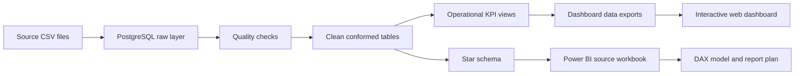

# Supply Chain & Operations Control Tower

I built this project around a realistic operations problem: a German fulfilment network has order, shipment, inventory, customer, warehouse, product, and carrier data in separate files, but no reliable view of delivery performance or operational risk. The project takes those raw files through data-quality testing, cleaning, SQL analysis, dimensional modelling, and an interactive management dashboard.

All records and business results are synthetic. This is a portfolio case study and does not claim work completed for a real company.

**[Open the live dashboard](https://akshayamin13.github.io/supply-chain-operations-control-tower/)**


## Project overview

This repository shows the full path from source data to a management-ready BI product:

- 30,000 orders across a complete 12-month reporting period
- linked shipment, inventory, product, warehouse, carrier, and customer data
- reproducible data generation in Python with a fixed random seed
- PostgreSQL layers for raw data, cleaned data, reusable KPI views, and a star schema
- 18 source-data quality checks and 10 dimensional-model checks
- operational analysis covering delivery, backlog, capacity, stockouts, exceptions, carriers, and customer segments
- a responsive web dashboard with working warehouse, carrier, and product-category filters
- Power BI-ready tables, DAX measures, relationship maps, and a report specification
- supporting documentation for reproduction, interviews, and portfolio use

## Business problem

Management receives separate operational files and cannot answer important questions consistently:

1. Are orders being delivered on time and within the promised SLA?
2. Which warehouses, carriers, and exception types account for the weakest performance?
3. Where is open backlog accumulating, and how much order value is tied up in it?
4. Are stockouts associated with slower fulfilment?
5. How do demand, revenue, throughput, and inventory conditions change over time?

The control tower creates one governed analytical layer for these questions.

## Project workflow



The raw layer preserves the source records. Cleaning rules standardise usable values and flag invalid records without silently hiding them. The analytics layer then provides one consistent definition for each KPI and a dimensional model suitable for BI reporting.

## Dataset

| Area | Scope |
|---|---:|
| Reporting period | 1 September 2025–31 August 2026 |
| Analysis date | 1 September 2026 |
| Orders | 30,000 |
| Shipments | 28,534 |
| Daily inventory snapshots | 262,800 |
| Products | 120 |
| Warehouses | 6 |
| Carriers | 7 |
| Customers | 4,000 |

The generator deliberately adds a controlled number of duplicate records, broken relationships, inconsistent labels, impossible dates, missing values, and inventory anomalies. The expected cases are recorded in the [quality manifest](data/quality_manifest.json), which lets the validation script distinguish intentional test cases from unexpected damage.

## Validated KPI results

| KPI | Result |
|---|---:|
| Analysis-eligible orders | 29,873 |
| Analysis-eligible shipments | 28,366 |
| Revenue | €3,221,285.15 |
| Average order value | €110.71 |
| On-time delivery | 62.32% |
| Late delivery | 37.68% |
| Average delivery delay | 0.76 days |
| Average fulfilment lead time | 1.43 days |
| Open backlog | 688 orders |
| SLA breach rate | 38.78% |
| Throughput | 67,281 units |
| Stockout rate | 0.35% |
| Inventory turnover | 4.30 |
| Shipment exception rate | 28.14% |

The [KPI catalogue](documentation/05_kpi_catalog.md) documents the business definition, formula, grain, and denominator for each measure.

## Main findings

- The Rhine-Ruhr Fulfilment Centre in Cologne is the main constraint in this scenario: 55.62% on-time delivery, a 36.81% shipment exception rate, and 117 days above capacity.
- Warehouse-capacity exceptions affect 4,709 shipments. They represent 59% of recorded exceptions and are associated with 3,822 late deliveries.
- Economy services perform worst in the simulated carrier mix. Alpine Freight records 27.98% on-time delivery and EuroLink Standard 30.81%, while the two express carriers are close to 86%.
- Orders linked to a stockout are late 96.70% of the time, compared with 36.98% for orders without a linked stockout. This is an association in the generated data, not proof that the stockout caused the delay.
- The open backlog contains 688 orders. Of these, 464 are at least 15 days old and represent €52,374.40 in order value.
- Monthly demand peaks at 3,884 orders in December and falls to 2,075 in January, making seasonal capacity planning an important management issue.

The supporting queries, evidence, limitations, and recommendations are in [findings and recommendations](documentation/07_findings_and_recommendations.md).

## Interactive dashboard

The **[public dashboard](https://akshayamin13.github.io/supply-chain-operations-control-tower/)** has four views:

- **Executive overview:** headline KPIs, monthly order and revenue trends, warehouse delivery performance, backlog ageing, and customer segments
- **Fulfilment:** carrier performance, warehouse throughput and delivery, cost, SLA, and exception analysis
- **Inventory:** category-level stockout risk, shipped units, inventory value, turnover, and warehouse capacity utilisation
- **Diagnostics:** high-risk orders and exception patterns for operational follow-up

Warehouse, carrier, and product-category selections update the relevant visuals and KPI cards. The dashboard is built with React, TypeScript, Recharts, and Vite, and GitHub Actions publishes it from the `dashboard/` folder.

## Dimensional model

The PostgreSQL model keeps transaction-level detail and uses shared conformed dimensions.

| Fact table | Grain | Rows |
|---|---|---:|
| `analytics.fact_orders` | one row per unique order | 30,000 |
| `analytics.fact_shipments` | one row per unique shipment | 28,534 |
| `analytics.fact_inventory` | one product–warehouse–date snapshot | 262,800 |

The Date, Product, Customer, Warehouse, and Carrier dimensions can filter the related facts. Unknown-member rows preserve referential integrity when a source key is missing or invalid. See the [dimensional-model notes](documentation/06_dimensional_model.md) for the grain and relationship rules.

## Repository structure

```text
dashboard/          interactive React dashboard and GitHub Pages build
data/raw/           reproducible source-like CSV files
data/processed/     management-ready SQL result exports
documentation/      business, technical, learning, and interview notes
outputs/            Power BI browser-source workbook
powerbi/            DAX, theme, relationship maps, and report specification
scripts/            data generation, validation, pipeline, and workbook tools
sql/                numbered PostgreSQL pipeline and learning queries
```

The numbered SQL scripts follow the actual processing order:

1. Create the database and schemas.
2. Define and import the raw tables.
3. Run source-data checks.
4. Clean and conform the records.
5. Calculate KPIs and operational analysis.
6. Build and test the star schema.
7. Export reporting tables.

## Reproduce the analysis

Requirements:

- Python 3.9 or newer
- PostgreSQL 16 or another compatible recent release
- Git
- Node.js 22 and pnpm only if you want to run the web dashboard locally

Generate and validate the source files:

```bash
python3 scripts/generate_data.py
python3 scripts/validate_generated_data.py
```

Run the complete PostgreSQL pipeline:

```bash
bash scripts/run_pipeline.sh
```

The pipeline creates the local `supply_chain_control_tower` database when required, runs the numbered SQL files in order, and stops if a quality test fails. Environment setup and verification queries are covered in the [reproduction guide](documentation/09_reproduction_guide.md).

Run the dashboard locally:

```bash
cd dashboard
pnpm install
pnpm dev
```

## Power BI workflow on an Intel Mac

Power BI Desktop does not run natively on macOS. The repository therefore prepares the SQL model first and includes a browser-oriented reporting handoff:

- an [Excel source workbook](outputs/01a05dcc-9968-7a81-be26-ed89df7d1a66/control_tower_powerbi_browser_source.xlsx) with eight named tables
- [aggregate DAX measures](powerbi/measures_browser_aggregate.dax) for the compact browser model
- [transaction-level DAX measures](powerbi/measures.dax) for the full model
- relationship maps for both model options
- a four-page [dashboard specification](powerbi/dashboard_specification.md)
- a reusable [Power BI theme](powerbi/control_tower_theme.json)

All 16 headline measures in the compact workbook have been reconciled with the PostgreSQL results. The Power BI report pages are not presented as finished because they still need to be assembled in a signed-in Power BI workspace or a Windows environment. The [Mac workflow](powerbi/mac_workflow.md) explains both routes.

## Documentation

- [Project roadmap](documentation/00_project_roadmap.md)
- [Database basics](documentation/01_database_basics.md)
- [Source-data design](documentation/02_source_data_design.md)
- [Data dictionary](documentation/03_data_dictionary.md)
- [SQL pipeline walkthrough](documentation/04_sql_pipeline.md)
- [KPI catalogue](documentation/05_kpi_catalog.md)
- [Dimensional model](documentation/06_dimensional_model.md)
- [Findings and recommendations](documentation/07_findings_and_recommendations.md)
- [Interview guide](documentation/08_interview_guide.md)
- [Reproduction guide](documentation/09_reproduction_guide.md)
- [CV and portfolio wording](documentation/10_cv_and_portfolio.md)
- [SQL learning reference](documentation/11_sql_learning_reference.md)

## Skills demonstrated

PostgreSQL, SQL data cleaning, data-quality testing, KPI governance, dimensional modelling, supply-chain analysis, root-cause investigation, DAX design, Power BI semantic modelling, Python data generation, Git, dashboard development, and business communication.

The project is intended for Operations Analyst, Supply Chain Analyst, Logistics Analyst, BI Analyst, Reporting Analyst, Inventory Analyst, and Operations Performance Analyst applications in Germany.
